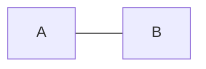
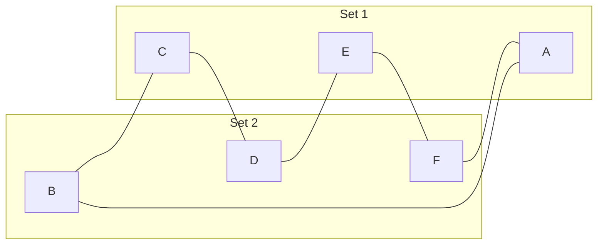
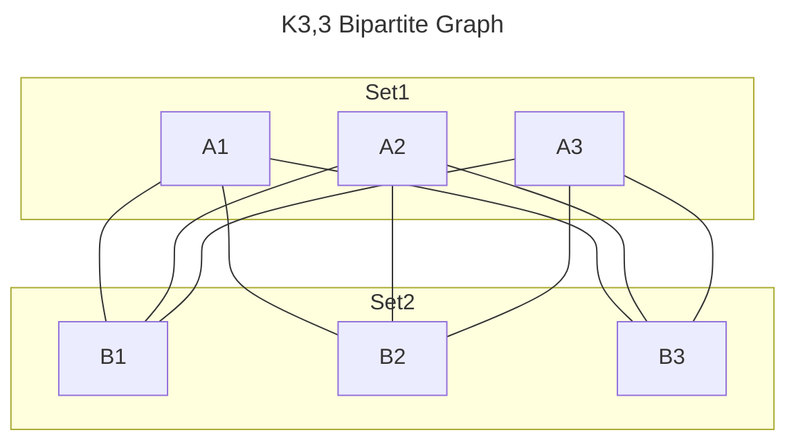
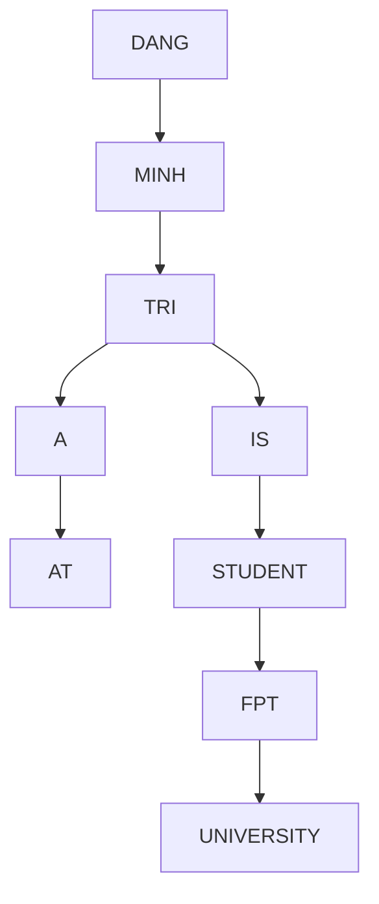
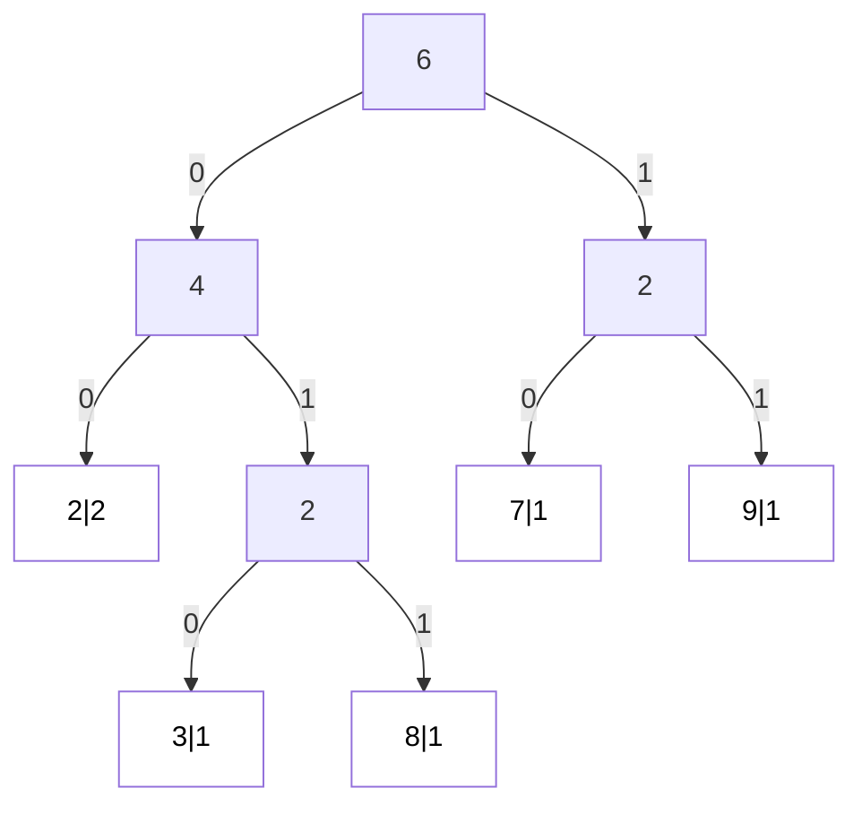
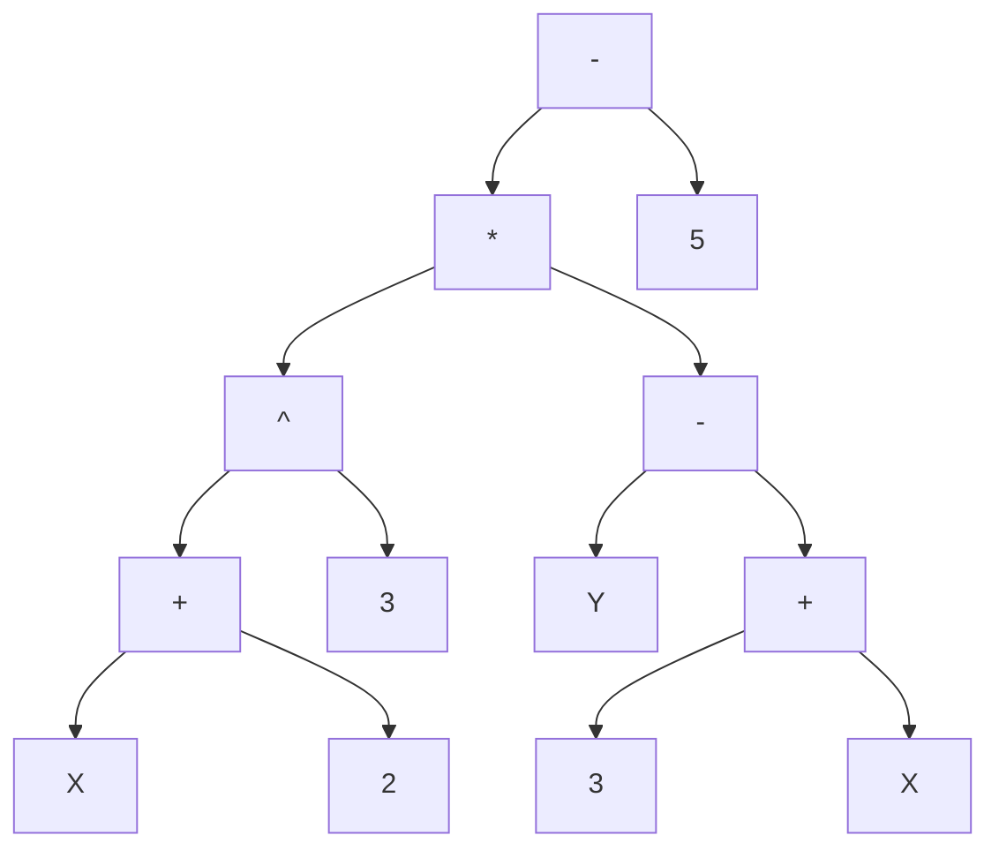

  <h1>MAD101 - Assignment 3</h1>
  <h2>Deadline: July 21, 2023</h2>

---

### Q1: For which values of $n$ are these graphs bipartite?

a) ${K_n}$

1. Để $K_n$ là `bipartite graph` thì đồ thị phải thoả mãn định nghĩa sau:

> A simple graph G is called bipartite if its vertex set V can be partitioned into two disjoint sets V1 and V2 such that every edge in the graph connects a vertex in V1 and a vertex in V2 (so that no edge in G connects either two vertices in V1 or two vertices in V2). When this condition holds, we call the pair (V1, V2) a bipartition of the vertex set V of G.

$\Rightarrow n \geq 2$ với $n \in \mathbb{Z}$ để tối thiểu có 2 đỉnh để xét phân chia thành 2 tập hợp rời nhau.

2. vì $K_n$ là `complete graph` nên với mỗi cặp đỉnh phân biệt sẽ có 1 cạnh theo mô tả bên dưới

> Complete Graphs A complete graph on n vertices, denoted by Kn, is a simple graph that contains exactly one edge between each pair of distinct vertices. The graphs Kn, for n = 1, 2, 3, 4, 5, 6, are displayed in Figure 3. A simple graph for which there is at least one pair of distinct vertex not connected by an edge is called noncomplete.

$\Rightarrow$ Với `complete graph` mỗi đỉnh đều có cạnh nối các đỉnh còn lại, vai trò của các đỉnh như nhau, vì vậy số tập hợp có thể chia được vừa đúng bằng $n$, mà `bipartite graph` chỉ có 2 tập hợp nên chỉ có $n = 2$ thoả mãi

$\Rightarrow n = 2$ thì $K_n$ là `bipartite graph`.

b) ${C_n}$

Để $C_n$ là `bipartite graph` thì đồ thị phải thoả mãn định nghĩa của `bipartite graph` nhưng với $\forall n = 2k \geq 4, k \in \mathbb{N}$ tạo được đồ thị $C_n$ luôn có cách để chia đồ thị thành 2 tập hợp khác nhau.

Vậy với $\forall n = 2k \geq 4, k \in \mathbb{N}$ là `bipartite graph`.

c) ${W_n}$

Đồ thị `wheel graph` luôn tồn tại 3 đỉnh liên tiếp được nối với nhau nên không có giá trị $n$ thoả mãn $C_n$ là `bipartite graph`.

d) ${Q_n}$

Đồ thị lập phương tương tự như cách biểu diễn xâu nhị phân từ $0$ đến $2^n-1$, vì vậy luôn có thể chia thành 2 nhóm chẵn và lẻ. Vì vậy với $\forall n \in \mathbb{N}^*$ thì đồ thị ${Q_n}$ luôn là `bipartite graph`.

### Q2: What is the sum of the entries in a row of the adjacency matrix for an undirected graph? For a directed graph?

Tổng các phần tử của hàng trong ma trận liền kề trong đồ thị vô hướng là bậc của đỉnh ở hàng đó.

Tổng các phần tử của một hàng trong ma trận liền kề của đồ thị có hướng là bậc ra của đỉnh tương ứng. Bậc ra của một đỉnh là số cạnh đi ra khỏi đỉnh đó.

### Q3: Find the number of paths of length n between any two adjacent vertices in $K_{3,3}$ for the following values of $n$:

Student ID: `HE176821`

a) $n =$ sum of digit in student ID $\Rightarrow n = 1 + 7 + 6 + 8 + 2 + 1 = 25$

Vì mỗi phẩn tử trong cùng 1 set không có liên kết đến nhau, nên path để có thể đi đến 2 đỉnh kể nhau là lẻ, $\Rightarrow n = 25$ có tồn tại path đi giữa 2 đỉnh kề nhau.
vì vậy số path có thể nếu lấy cố định 1 đỉnh A đến 1 đỉnh liền kề B khác là $3^{24}$ vì từ đỉnh A ở set 1 có 3 sự lựa chọn để đến set 2, và cũng có 3 sự lựa chọn để đi từ set 2 về set 1.

b) n = 25 + 1 = 26
chiều dài path là chẵn nên không tồn tại path nào thoả mãn.

### Q4:For which values of n do these graphs have an Euler circuit?

Để tồn tại `Euler circuit` thì phải thoả mãn lý thuyết 

> A connected multigraph with at least two vertices has an Euler circuit if and only if each of its vertices has even degree.

(a) $K_n$: Một đồ thị đầy đủ $K_n$ có $n$ đỉnh và mỗi đỉnh có bậc $n-1$. Vậy $K_n$ có vòng Euler khi và chỉ khi $n$ lẻ.

(b) $C_n$: Một đồ thị vòng tròn $C_n$ có $n$ đỉnh và mỗi đỉnh có bậc là 2. Vậy $C_n$ có vòng Euler khi và chỉ khi $n \geq 3$.

(c) $W_n$: Một đồ thị bánh xe $W_n$ có $n$ đỉnh và mỗi đỉnh có bậc là 3 và 1 đỉnh có bậc là $n - 1$. Vậy $W_n$ không có vòng Euler.

(d) $Q_n$: Một đồ thị tứ giác $Q_n$ có $n$ đỉnh và mỗi đỉnh có bậc là n. Vậy $Q_n$ có vòng Euler khi và chỉ khi $n$ là số chẵn.

### Q5: How many non-isomorphic simple graphs are there with five vertices and three edges?

có 4 loại đồ thị không dẳng cáu mà có 5 đỉnh và 3 cạnh

### Q6: Using alphabetical order, construct a binary search tree for the words in the sentence “[Your full name] is a student at FPT University.”

“DANG”, “MINH”, “TRI”, “IS”, “A”, “STUDENT”, “AT”, “FPT”, “UNIVERSITY”

Chúng ta sử dụng giải thuật sau để tìm vị trí cho các từ trong cây tìm kiếm nhị phân

### Q7: Use `Huffman coding` to encode the symbols in string "287932"

`Student ID: HE176821`
`String to encode: 287932`

Chúng ta sử dụng giảti thuật `Huffman` sau để giải quyết bài toán

Kết quả thu được bảng sau

| Ký tự | Tần số | Mã Huffman |
|-------|-------|------------|
| 2     | 2     | `00`       |
| 3     | 1     | `010`      |
| 8     | 1     | `011`      |
| 7     | 1     | `10`       |
| 9     | 1     | `11`       |

Kết quả mã hóa của xâu "287932" là: `00011101111010`.

Số bit trung bình = $\frac{{(2 \times 2) + (1 \times 3) + (1 \times 3) + (1 \times 2) + (1 \times 2)}}{{2 + 1 + 1 + 1 + 1}} = \frac{14}{6} \approx 2.33$ bit

### Q8: Describe the trees produced by breadth-first search and depth-first search of the following graphs:

(a) $K_n$:

BFS: Cây tìm kiếm theo chiều rộng bao gồm tất cả các đỉnh, với đỉnh bắt đầu là gốc và các đỉnh còn lại là con của gốc.

DFS: Cây tìm kiếm theo chiều sâu là cây bao trùm với tất cả các đỉnh của đồ thị, tuy nhiên thứ tự duyệt các đỉnh có thể thay đổi tùy vào đỉnh bắt đầu.

(b) $W_n$, bắt đầu từ điểm trung tâm:

BFS: Từ đỉnh trung tâm (hub), BFS duyệt các đỉnh theo khoảng cách từ trung tâm, đi qua các cánh đầu tiên sau đó là vòng ngoài của đồ thị.

DFS: DFS bắt đầu từ đỉnh trung tâm sẽ duyệt các cánh trước, đi sâu nhất có thể theo từng cánh trước khi trở về đỉnh trung tâm.

### Q9:

Prefix Notation: ${- \times \uparrow + x \ 2 \ 3 - y + x \ 3 \ 5}$

Post Notation: ${x \ 2 + 3 \uparrow y \ x \ 3 + - \times 5 -}$

### Q10: Which connected simple graphs have exactly one spanning tree?

Các đồ thị đơn liên thông có chính xác một cây bao trùm được gọi là "tree". Cây là một loại đồ thị liên thông cụ thể thỏa mãn các thuộc tính sau:

1. Liên thông, nghĩa là tồn tại một đường đi giữa hai đỉnh bất kỳ của đồ thị.
2. Nó không tuần hoàn, nghĩa là nó không có chu kỳ hoặc vòng lặp.
3. Đồ thị có n - 1 cạnh, trong đó n là số đỉnh của đồ thị.

**Em có thấy điểm Assignment của em thầy vẫn để là 1 ấy ạ, nhờ thầy sửa lại điểm theo bài em đã nạp và gửi qua mail. Em xin cảm ơn ạ. HE176821**
