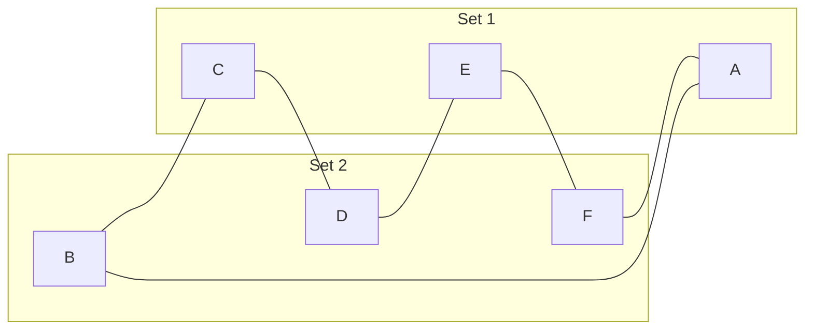

  <h1>MAD101 - Assignment 3</h1>
  <h2>Deadline: July 21, 2023</h2>

---

### Q1: For which values of $n$ are these graphs bipartite?

a) ${K_n}$

1. Để $K_n$ là `bipartite graph` thì đồ thị phải thoả mãn định nghĩa sau:

> A simple graph G is called bipartite if its vertex set V can be partitioned into two disjoint sets V1 and V2 such that every edge in the graph connects a vertex in V1 and a vertex in V2 (so that no edge in G connects either two vertices in V1 or two vertices in V2). When this condition holds, we call the pair (V1, V2) a bipartition of the vertex set V of G.

$\Rightarrow n \geq 2$ với $n \in \mathbb{Z}$ để tối thiểu có 2 đỉnh để xét phân chia thành 2 tập hợp rời nhau.

2. vì $K_n$ là `complete graph` nên với mỗi cặp đỉnh phân biệt sẽ có 1 cạnh theo mô tả bên dưới

> Complete Graphs A complete graph on n vertices, denoted by Kn, is a simple graph that contains exactly one edge between each pair of distinct vertices. The graphs Kn, for n = 1, 2, 3, 4, 5, 6, are displayed in Figure 3. A simple graph for which there is at least one pair of distinct vertex not connected by an edge is called noncomplete.

$\Rightarrow$ Với `complete graph` mỗi đỉnh đều có cạnh nối các đỉnh còn lại, vai trò của các đỉnh như nhau, vì vậy số tập hợp có thể chia được vừa đúng bằng $n$, mà `bipartite graph` chỉ có 2 tập hợp nên chỉ có $n = 2$ thoả mãi

$\Rightarrow n = 2$ thì $K_n$ là `bipartite graph`.

b) ${C_n}$

Để $C_n$ là `bipartite graph` thì đồ thị phải thoả mãn định nghĩa của `bipartite graph` nhưng với $\forall n = 2k \geq 4, k \in \mathbb{N}$ tạo được đồ thị $C_n$ luôn có cách để chia đồ thị thành 2 tập hợp khác nhau.

Vậy với $\forall n = 2k \geq 4, k \in \mathbb{N}$ là `bipartite graph`.

c) ${W_n}$

Đồ thị `wheel graph` luôn tồn tại 3 đỉnh liên tiếp được nối với nhau nên không có giá trị $n$ thoả mãn $C_n$ là `bipartite graph`.

d) ${Q_n}$

Đồ thị lập phương tương tự như cách biểu diễn xâu nhị phân từ $0$ đến $2^n-1$, vì vậy luôn có thể chia thành 2 nhóm chẵn và lẻ. Vì vậy với $\forall n \in \mathbb{N}^*$ thì đồ thị ${Q_n}$ luôn là `bipartite graph`.

### Q2: What is the sum of the entries in a row of the adjacency matrix for an undirected graph? For a directed graph?

Tổng các phần tử của hàng trong ma trận liền kề trong đồ thị vô hướng là bậc của đỉnh ở hàng đó.

Tổng các phần tử của một hàng trong ma trận liền kề của đồ thị có hướng là bậc ra của đỉnh tương ứng. Bậc ra của một đỉnh là số cạnh đi ra khỏi đỉnh đó.

### Q3: Find the number of paths of length n between any two adjacent vertices in $K_{3,3}$ for the following values of $n$:

### Q4:

### Q5:

### Q6:

### Q7:

### Q8:

### Q9:

### Q10:
